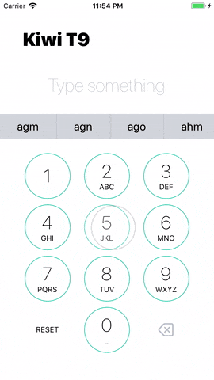

# Kiwi T9

## Assignment

Implement a number to word list converter as a Node backend and React fronted.
The backend should provide a rest endpoint that converts a given numeric string into a list of corresponding words in the style of [T9](<https://en.wikipedia.org/wiki/T9_(predictive_text)>) or [Phonewords](https://en.wikipedia.org/wiki/Phoneword). For example, given the input 23 the output should be: `ad, ae, af, bd, be, bf, cd, ce, cf`
The frontend should allow the user to enter a number, query the backend for the corresponding expansions, and display them.

The solution should be shared with us in a git repository with real history included.
It's OK not to deliver 100%, but the more working parts the better. For example if you
struggle with the backend, focus on frontend and just mock the API calls.

Take this task as a chance to present your skills. If you are good in UI, let us see that. If you are more into the backend, it's OK to have simple FE.

If you know what tests are for, don't keep it for yourself, show it in the code.

Ways to go beyond the minimal solution could include for example:

- phone keyboard -like UI
- great project setup
- mobile app in React Native
- filtering to include only real words based on a suitable word list

The task should contain unit tests.

## Demo



## Installation and run

### Prerequisites

Install:

- NodeJS: https://nodejs.org
- Expo: https://docs.expo.io/versions/v30.0.0/introduction/installation
- Yarn: https://yarnpkg.com/lang/en/docs/install/#mac-stable

Clone repository:

```
git clone https://github.com/jvaclavik/kiwi-t9
cd kiwi-t9
```

### Install Server

```
cd server       # List proper directory
yarn            # Install dependencies
yarn start      # Start NodeJS server
```

Server will run on: http://localhost:3000

### Install Client

```
cd client       # List proper directory
yarn            # Install dependencies
expo start      # Start Expo
```

Scan QR code or click on `Run on iOS simulator`

## Project structure

- **Server** is based on NodeJS, Express, Nodemon and Supertest
- **Client** is a mobile app based on React Native, Expo, Jest and Flow.

```
├── README.md
├── client
│   ├── App.js              # Mobile app entry point
│   ├── app.json            # Expo app configuration
│   ├── assets              # Icon and Splash screen assets
│   ├── package.json
│   ├── src                 # Mobile app source code
│   │   ├── components      # Components
│   │   ├── config          # Basic app configs
│   │   ├── containers      # Contains RootContainer (main screen)
│   │   ├── services        # Defines API
│   │   ├── themes          # Defines colors, metrics and fonts
│   │   ├── types
│   │   └── utils           # Component independent utils
│   └── yarn.lock
├── demo.gif
└── server
    ├── __tests__
    ├── app.js              # Server entry point
    ├── bin
    ├── package.json
    ├── public
    ├── routes              # Defines routes and main logic
    ├── utils               # Custom utils
    ├── views
    └── yarn.lock
```

## Testing

### Run server tests

```
cd server
yarn test
```

### Run client tests

```
cd client
yarn test
```

## API docs

### Words [`/words`]

#### Retrieve words [`GET`]

Retrieves words based on T9 number combination.

- Parameters
  - input: (number) - T9 number combination (`^[23456789]+$`)

* Response 200 (application/json)

  - Body

            [
                "ad",
                "ae",
                "af",
                "bd",
                "be",
                "bf",
                "cd",
                "ce",
                "cf"
            ]

- Response 400 (application/json)

  - Body

            {
                "errors": [
                    "Bad input. Allowed pattern is: ^[23456789]+$"
                ]
            }

- Response 400 (application/json)

  - Body

            {
                "errors": [
                    "No input."
                ]
            }

## Future improvements

- Use real word dictionary
- Use frequency analysis to mark proper word relevance
- Solve upper case characters, diacritic and special characters
- Think about better UX
- Test app on Android phones
